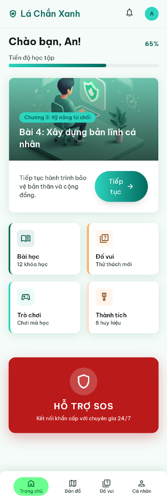
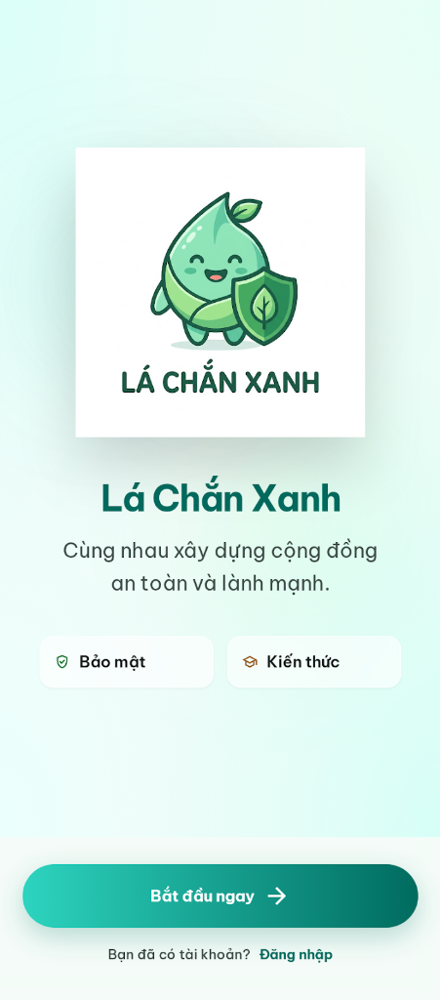
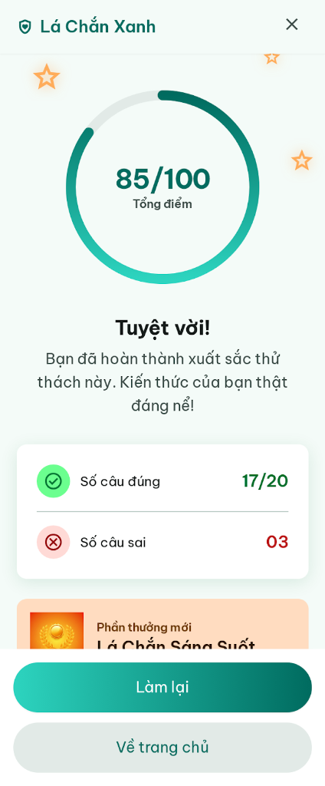
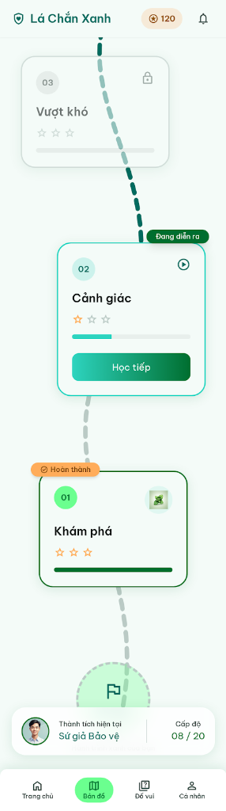
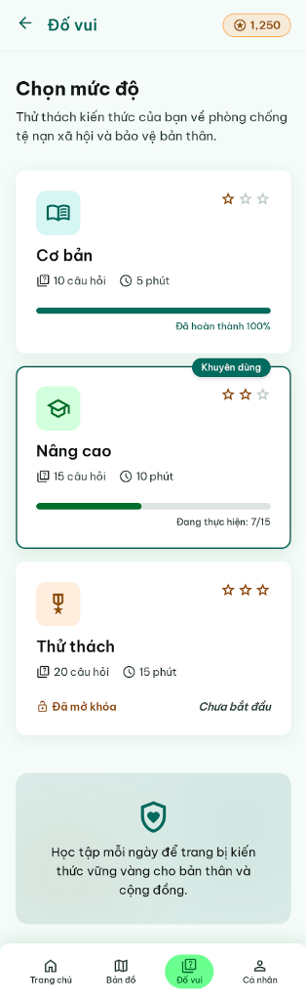

# Lá Chắn Xanh - Prototype

Đây là bản prototype (React + Tailwind CSS) của dự án Lá Chắn Xanh, được xây dựng dựa trên thiết kế từ Stitch MCP. Ứng dụng là một nền tảng học tập gamified giúp cung cấp kiến thức bảo vệ bản thân và phòng chống tệ nạn xã hội.

## 🚀 Hướng dẫn cài đặt và chạy dự án

### Yêu cầu hệ thống
- [Node.js](https://nodejs.org/) (khuyến nghị phiên bản 18.x trở lên)
- npm (thường đi kèm với Node.js)

### Các bước thực hiện

1. **Di chuyển vào thư mục dự án**
   Mở terminal (hoặc Command Prompt) và đi đến thư mục `app`:
   ```bash
   cd app
   ```

2. **Cài đặt các gói thư viện (Dependencies)**
   Chạy lệnh sau để tải và cài đặt các thư viện cần thiết:
   ```bash
   npm install
   ```

3. **Khởi chạy máy chủ phát triển (Development Server)**
   Sau khi cài đặt xong, chạy lệnh sau để khởi động dự án:
   ```bash
   npm run dev
   ```

4. **Xem kết quả**
   Mở trình duyệt web của bạn và truy cập vào đường dẫn mà Vite cung cấp trên terminal (thường là `http://localhost:5173/`).
   
   > 💡 **Mẹo:** Ứng dụng được thiết kế theo giao diện Mobile-first và đặt trong một khung điện thoại ảo. Nó sẽ hiển thị hoàn hảo ngay cả khi bạn xem toàn màn hình trên máy tính.

## 🎨 Công nghệ sử dụng
- **React 19** - Thư viện UI
- **Vite** - Trình đóng gói siêu tốc
- **Tailwind CSS v4** - Framework CSS tiện ích
- **Lucide React** - Hệ thống biểu tượng (Icons)

## 📸 Giao diện thiết kế (Stitch UI)

### 1. Home Dashboard & 2. Splash Screen
<div style="display: flex; gap: 10px;">
  
  
</div>

### 3. Result Screen & 4. Learning Map
<div style="display: flex; gap: 10px;">
  
  
</div>

### 5. Quiz Select

